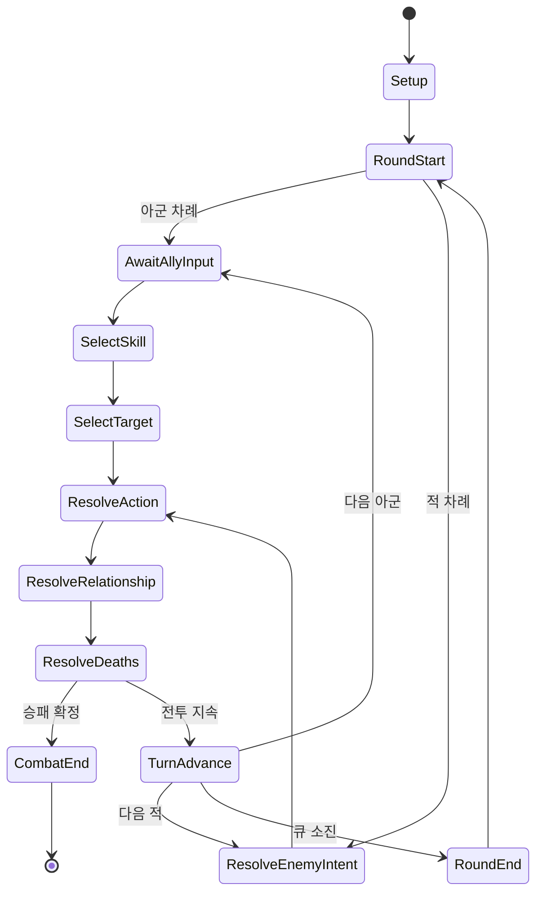

# 서울식 진형 전투 시스템 개편 설계

작성일: 2026-06-15
상태: 사용자 방향 승인 완료, 구현 전 설계 고정
참고 자료:

- `C:\Users\USER\Downloads\survival_seoul_battle_system_doc.md`
- Darkest Dungeon II 플레이 영상: <https://youtu.be/awTabNsL3HU>
- 현재 구현: `js/systems/CombatSystem.js`, `js/systems/CombatActions.js`, `js/ui/CombatUI.js`
- 디자인 기준: `DESIGN.md`, `css/variables.css`

## 1. 목표

현재의 플레이어 중심 전투를 최대 3인의 아군을 직접 조작하는 진형 기반 턴제 전투로 개편한다.
Darkest Dungeon II에서 참고하는 범위는 전투 정보 구조, 위치 제약, 행동 선택 흐름, 토큰 가독성이다.
그래픽 자산, 명칭, 수치, 캐릭터 표현과 화면 장식은 `Survival: Seoul`의 산업적 디자인과 생존 자원 체계를 유지한다.

핵심 목표는 다음과 같다.

1. 플레이어와 최대 2명의 동료를 동일한 전투원 규칙으로 직접 조작한다.
2. 아군과 적군에 각각 4칸 진형을 제공하고, 이동이나 사망으로 생긴 빈칸을 자동 압축하지 않는다.
3. 캐릭터 고유 스킬 3개와 장비 스킬 2개를 한 행동 바에 제공한다.
4. 감염, 소음, 탄약, 내구도처럼 기존 생존 자원을 전술 선택의 비용으로 유지한다.
5. 토큰, 스트레스, 죽음의 문턱, 관계 반응으로 단기 전술과 장기 생존 상태를 연결한다.
6. 중앙 전장을 화면의 주인공으로 두고 상세 패널은 선택 또는 호버 시에만 표시한다.

## 2. 확정된 전투 규칙

### 2.1 전투 인원과 진형

- 아군은 플레이어 1명과 동료 최대 2명으로 구성한다.
- 양 진영은 각 4칸을 사용한다. 아군은 화면 왼쪽에서 오른쪽으로 `4, 3, 2, 1`, 적군은 화면 오른쪽에서 왼쪽으로 `1, 2, 3, 4`로 해석한다.
- 전투 시작 시 생존 아군은 전열부터 빈칸 없이 배치한다.
- 전투 중 이동, 밀치기, 당기기, 사망으로 생긴 빈칸은 유지한다.
- 스킬은 `usableFrom`과 `targetRanks`로 사용 위치와 대상 위치를 선언한다.
- 이동 효과는 다른 전투원을 통과하지 않는다. 목적지가 비어 있을 때만 이동한다.
- 진형이 무너지더라도 자동 정렬하지 않는다. 재배치는 이동 스킬 또는 전용 이동 행동으로 수행한다.

### 2.2 라운드와 행동 순서

- 매 라운드 시작 시 살아 있거나 죽음의 문턱에 있는 모든 전투원의 행동 순서를 다시 계산한다.
- 기본 공식은 `speed + random(0, initiativeRollMax)`이다.
- 동점이면 이전 라운드 순서가 아닌 안정적인 `combatantId` 순으로 결정해 재현 가능한 테스트를 보장한다.
- 기절, 행동 불능, 사망 상태는 차례가 왔을 때 건너뛴다.
- 아군 차례에는 플레이어와 동료를 구분하지 않고 동일한 스킬 선택 흐름을 사용한다.
- 적 차례는 미리 표시된 의도를 실행한 뒤 다음 라운드 의도를 계산한다.

### 2.3 스킬과 전투 아이템

- 각 아군의 기본 행동 바는 고유 스킬 3개와 장비 스킬 2개로 구성한다.
- 장비 스킬은 현재 장착 무기와 보조 장비에서 생성한다. 탄약, 내구도, 소음 비용은 기존 아이템 데이터를 사용한다.
- 전투 아이템은 행동 바와 분리된 1개 슬롯으로 제공한다.
- 전투 아이템 사용은 현재 행동을 소모하지 않지만, 한 전투원 차례에 한 번만 사용할 수 있다.
- 아이템 사용 후에도 스킬을 선택할 수 있으며, 수량이 0이 되면 기존 카드 인스턴스 제거 흐름을 사용한다.
- 모든 스킬은 실행 전 사용 위치, 유효 대상, 자원 비용을 검증한다. 실패한 검증은 상태를 변경하지 않는다.

### 2.4 토큰과 지속 상태

상태를 두 계층으로 구분한다.

- 전술 토큰: 짧고 이산적인 효과. 예: 방어, 회피, 취약, 약화, 도발, 표식.
- 지속 상태: 수치와 기간을 갖는 생존 효과. 예: 출혈, 화상, 감염, 산성 화상, 기절.

전술 토큰은 `tokens[tokenId] = stacks` 형태로 저장하고 스킬 해결 단계에서 소비한다.
지속 상태는 기존 배열 기반 상태 데이터를 공통 `statusEffects` 배열로 정규화한다.
UI는 토큰을 전투원 상단, 지속 상태를 HP 하단에 표시한다.

### 2.5 스트레스와 관계

- 각 아군 전투원은 전투용 스트레스 `0..10`을 가진다.
- 피격, 아군의 죽음의 문턱 진입, 치명타, 적 특수 행동으로 스트레스가 증가한다.
- 지원 스킬, 적 처치, 관계 반응으로 스트레스를 감소시킬 수 있다.
- 스트레스가 10에 도달하면 기본적으로 붕괴가 발생하며 HP, 관계도, 부정 토큰에 영향을 준다.
- 낮은 확률로 각성이 발생해 스트레스를 낮추고 긍정 토큰을 얻는다.
- 판정 후 스트레스는 설정값으로 내려가며 같은 이벤트에서 연속 판정하지 않는다.

기존 `bond`는 전투 관계도로 재사용한다.

- 높은 관계도는 지원, 보호, 추가 회복과 같은 긍정 반응 확률을 높인다.
- 낮은 관계도는 스트레스 증가, 스킬 방해, 원치 않는 대상 변경 같은 부정 반응 확률을 높인다.
- 관계 반응은 행동 전 또는 행동 후 한 번만 판정한다.
- 반응은 별도 행동 순서를 만들지 않고 현재 행동의 부가 사건으로 해결한다.
- 스킬 정의는 관계도에 따라 추가되는 `relationshipModifiers`를 선택적으로 가질 수 있다.

### 2.6 죽음의 문턱

- 모든 아군은 HP가 0이 되면 즉시 사망하지 않고 죽음의 문턱에 진입한다.
- 죽음의 문턱 상태에서 회복하면 상태가 해제되고 최소 1 HP 이상으로 복귀한다.
- 죽음의 문턱 상태에서 추가 피해를 받을 때마다 사망 저항을 판정한다.
- 저항 실패 시 해당 전투원은 사망한다.
- 저항 성공 시 HP 0과 죽음의 문턱 상태를 유지하며 사망 저항 수치가 점차 감소한다.
- 플레이어가 사망하면 기존 `EndingSystem` 패배 흐름으로 연결한다.
- 동료가 사망하면 전투에서는 제거하되 전투 결과에서 사망 결과를 NPC 상태에 확정한다.

## 3. 상태 모델

`GameState.combat`에 전투 기간 동안만 유지되는 정규화 상태를 둔다.

```js
{
  active: true,
  roundNumber: 1,
  phase: 'round_start',
  combatants: {
    player: {
      id: 'player',
      side: 'ally',
      sourceType: 'player',
      sourceId: 'player',
      rank: 1,
      hp: 80,
      maxHp: 100,
      speed: 5,
      stress: 0,
      tokens: {},
      statusEffects: [],
      deathsDoor: false,
      deathResist: 0.75,
      itemUsedThisTurn: false,
      skillIds: []
    }
  },
  formations: {
    ally: [null, 'npc_nurse', 'npc_soldier', 'player'],
    enemy: ['enemy:0', 'enemy:1', null, null]
  },
  turnQueue: [
    { combatantId: 'npc_soldier', initiative: 9 },
    { combatantId: 'enemy:0', initiative: 7 }
  ],
  activeTurnIndex: 0,
  selectedSkillId: null,
  selectedTargetId: null,
  pendingIntentByEnemy: {},
  relationshipEvents: [],
  log: [],
  fxQueue: []
}
```

원본 플레이어, NPC, 적 데이터는 전투 중 직접 분기해 읽지 않는다.
전투 시작 시 어댑터가 공통 전투원 상태를 만들고, 전투 종료 시 영속 상태로 반영한다.
이렇게 해야 현재 `playerStatus`, NPC의 `statusEffects`, 적의 `_statusEffects`로 나뉜 처리를 하나의 규칙으로 해결할 수 있다.

## 4. 데이터 계약

### 4.1 스킬 정의

새 파일 `js/data/combatSkills.js`에서 스킬을 데이터로 선언한다.

```js
{
  id: 'soldier_suppressive_fire',
  nameKey: 'combatSkill.soldierSuppressiveFire',
  icon: '...',
  source: 'character',
  usableFrom: [2, 3, 4],
  target: {
    side: 'enemy',
    ranks: [2, 3, 4],
    count: 1
  },
  costs: {
    stamina: 8,
    ammo: 1,
    durability: 1,
    noise: 12
  },
  accuracy: 0.8,
  effects: [
    { type: 'damage', value: [8, 12] },
    { type: 'token', token: 'weakened', stacks: 1 }
  ]
}
```

효과는 문자열 분기 대신 등록된 효과 처리기로 실행한다.
초기 구현 범위는 피해, 회복, 토큰 부여/제거, 지속 상태, 이동, 스트레스, 방어, 도주로 제한한다.

### 4.2 기존 장비 호환

현재 아이템의 `combat` 필드를 `EnemyCombatAdapter`와 같은 방식의 장비 스킬 어댑터가 읽는다.
명시적 `combat.skillIds`가 있으면 해당 스킬을 사용하고, 없으면 기존 공격 데이터를 기본 장비 공격 스킬로 변환한다.
이전 세이브와 아이템 데이터는 즉시 전면 마이그레이션하지 않는다.

### 4.3 기존 적 호환

`js/data/enemies.js`의 적 정의는 다음 우선순위로 변환한다.

1. `combatProfile`이 있으면 전용 스킬, 속도, 위치, AI를 사용한다.
2. 기존 `specialSkills`, `attack`, `aiPattern`, `row`가 있으면 호환 스킬과 행동 가중치를 생성한다.
3. 필드가 부족하면 `BALANCE.combat` 기본값으로 일반 공격만 생성한다.

중요 적은 `combatProfile`을 직접 선언한다.
일반 적은 어댑터로 기존 데이터를 그대로 이용해 콘텐츠 전체 수정 없이 새 시스템에 진입시킨다.

## 5. 모듈 구조

현재 `CombatSystem.js`는 초기화, 턴 처리, 행동 해결, 적 AI, 보상, 패배 처리까지 담당한다.
새 기능을 계속 추가하지 않고 다음 책임으로 분리한다.

### `js/systems/CombatSystem.js`

- 전투 시작과 종료
- 라운드 및 턴 상태 전이 조정
- 하위 모듈 호출
- 기존 `EventBus`, `StateMachine`, 보상과 엔딩 흐름 연결

### `js/systems/combat/CombatantAdapter.js`

- 플레이어, NPC, 적을 공통 전투원으로 변환
- 전투 종료 시 HP, 상태, 사망 결과를 원본 상태에 반영

### `js/systems/combat/FormationSystem.js`

- 4칸 진형 생성
- 위치 조회
- 빈칸을 보존하는 이동, 밀치기, 당기기
- 스킬 사용 위치와 대상 위치 검증

### `js/systems/combat/InitiativeSystem.js`

- 매 라운드 속도 기반 행동 순서 계산
- 행동 가능 여부와 다음 전투원 선택

### `js/systems/combat/CombatSkillSystem.js`

- 스킬 로드아웃 구성
- 비용과 대상 검증
- 명중, 치명타, 효과 처리 순서 조정
- 장비 스킬의 탄약, 내구도, 소음 소비

### `js/systems/combat/CombatStatusSystem.js`

- 토큰 소비와 부여
- 지속 상태 틱
- 스트레스 임계 판정
- 죽음의 문턱과 사망 저항

### `js/systems/combat/RelationshipCombatSystem.js`

- 기존 NPC `bond`를 사용한 반응 후보 계산
- 행동 전후 긍정/부정 반응 해결
- 관계 변화 이벤트 기록

### `js/systems/combat/EnemyCombatAdapter.js`

- 기존 적 정의를 공통 스킬과 AI 프로필로 변환
- 전용 `combatProfile` 우선 적용
- 다음 행동 의도 결정

`js/systems/CombatActions.js`의 기존 함수는 새 효과 처리기가 준비될 때까지 호환 계층으로 유지한다.
새 UI는 `companionAttack`, `companionHeal`, stance 버튼을 호출하지 않는다.

## 6. 전투 상태 흐름



행동 해결 순서는 다음으로 고정한다.

1. 현재 전투원과 스킬 사용 가능 여부 검증
2. 전투 아이템 사용 여부와 자원 비용 검증
3. 관계의 행동 전 반응 판정
4. 명중과 치명타 판정
5. 피해, 회복, 토큰, 상태, 이동 효과 적용
6. 죽음의 문턱과 사망 처리
7. 관계의 행동 후 반응 판정
8. 승패 판정
9. 다음 행동으로 전환

UI는 상태를 직접 수정하지 않고 `CombatSystem.selectSkill`, `selectTarget`, `useCombatItem`, `confirmAction` 형태의 명령만 호출한다.

## 7. UI 설계: B 전장 집중형

### 7.1 화면 위계

- 상단: 지역, 시간, 날씨, 소음, 라운드를 한 줄로 압축한다.
- 상단 중앙: 현재 라운드의 행동 순서와 적 의도를 겹치지 않게 표시한다.
- 중앙: 화면 너비 대부분을 전장에 배정한다.
- 전장 왼쪽: 최대 3인의 아군과 4칸 위치.
- 전장 오른쪽: 적군과 4칸 위치.
- 전투원 주변: HP, 스트레스, 토큰, 지속 상태만 상시 표시한다.
- 하단 중앙: 현재 전투원의 스킬 5개.
- 하단 한쪽: 무료 전투 아이템 슬롯, 이동, 도주 등 공통 명령.
- 상세 정보: 선택 또는 키보드 포커스 시 팝오버로 표시한다.
- 전투 기록: 기본적으로 접힌 상태이며 최근 사건 한 줄만 전장 위에 짧게 표시한다.

현재 좌우의 `combat-player-panel`, `combat-enemy-panel`은 상시 패널에서 팝오버로 전환한다.
기존 `combat-visual`은 화면의 중심 영역을 차지하도록 확장한다.

### 7.2 선택 흐름

1. 아군 차례 시작 시 해당 전투원과 행동 바를 강조한다.
2. 스킬 호버 시 사용 가능 출발 위치와 대상 위치를 동시에 강조한다.
3. 스킬 클릭 시 유효 대상만 강하게 표시하고 나머지는 어둡게 처리한다.
4. 대상 클릭 시 피해 범위, 명중률, 소비 자원을 확인할 수 있는 짧은 미리보기를 표시한다.
5. 다시 클릭하거나 확인 키를 누르면 행동을 실행한다.
6. `Escape` 또는 우클릭으로 대상 선택과 스킬 선택을 한 단계씩 취소한다.

전투 아이템은 사용 후 행동 바가 유지되고 슬롯에 이번 차례 사용 완료 상태가 표시된다.

### 7.3 시각 언어

- `DESIGN.md`의 서울 폐허 산업 디자인을 유지한다.
- 배경은 `#0a0d14` 계열, 주요 강조는 `#c8a060` 계열 토큰을 사용한다.
- 정보 패널은 불투명한 카드보다 얇은 선, 어두운 반투명 배경, 작은 모노스페이스 텍스트를 우선한다.
- 토큰은 색상에만 의존하지 않고 도형과 짧은 라벨을 함께 사용한다.
- 행동 가능, 대상 가능, 위험 예고는 서로 다른 테두리 패턴을 사용한다.
- Darkest Dungeon II의 고유 장식, 아이콘, 프레임, 캐릭터 구도는 복제하지 않는다.

### 7.4 반응형 기준

- 1280px 이상: 전장 전체와 5개 스킬을 한 줄로 표시한다.
- 960~1279px: 행동 순서 슬롯 간격과 팝오버 폭을 줄인다.
- 959px 이하: 스킬 바를 가로 스크롤로 전환하고 상세 팝오버는 화면 하단 시트로 표시한다.
- 최소 클릭 영역은 40px 이상을 유지한다.

## 8. 기존 흐름과 마이그레이션

### 유지하는 연결

- `StateMachine`의 `combat`과 `combat_result` 전환
- `EventBus` 기반 전투 시작, 행동, FX 이벤트
- `NoiseSystem`, `StatSystem`, `NPCSystem`, `EndingSystem`
- 기존 아이템 카드 인스턴스와 수량, 내구도, 탄약 소비
- 승리 보상, XP, 전리품, 습격 결과 처리
- 적 의도와 timed threat 콘텐츠

### 교체하는 흐름

- `_buildTurnQueue`: 고정 순서에서 매 라운드 initiative 계산으로 교체
- `_processAiTurns`: 동료 자동 행동을 제거하고 적 행동만 연속 처리하도록 축소
- `_runCompanionTurn`과 stance UI: 새 직접 조작 흐름에서는 사용하지 않음
- `resolveAction`: 문자열 행동 분기에서 스킬 ID 기반 해결로 전환
- `playerStatus`, NPC 상태, 적 `_statusEffects`: 공통 전투원 상태로 정규화
- `CombatUI._renderInternal`: 3패널 구조에서 전장 집중형 구조로 재작성

기존 공개 함수는 한 번에 삭제하지 않는다.
테스트와 다른 시스템 호출을 확인하면서 호환 래퍼를 유지하고, 새 흐름이 안정된 뒤 제거한다.

## 9. 오류 처리와 불변 조건

다음 조건은 모든 전투 명령에서 보장한다.

- `activeCombatantId`와 명령 주체가 다르면 행동을 거부한다.
- 전투원이 없는 진형 칸을 대상으로 선택할 수 없다.
- 사용할 수 없는 위치의 스킬은 비용을 소비하지 않는다.
- 탄약, 내구도, 스태미나가 부족하면 행동 상태가 변하지 않는다.
- 무료 아이템은 차례당 한 번만 사용할 수 있다.
- 사망 전투원은 행동 큐와 유효 대상에서 제외한다.
- 죽음의 문턱 전투원은 회복 대상으로 선택할 수 있다.
- 행동 중 승패가 결정되면 관계 후속 반응과 다음 턴을 생성하지 않는다.
- 렌더 오류가 전투 상태를 변경하지 않는다.

## 10. 테스트 전략

### 단위 테스트

- 진형 초기 배치와 빈칸 유지
- 이동, 밀치기, 당기기의 경계 조건
- 출발 위치와 대상 위치 검증
- initiative 계산, 동점 처리, 라운드 재계산
- 토큰 중첩과 소비 순서
- 지속 상태 틱과 사망 판정
- 스트레스 붕괴와 각성
- 죽음의 문턱 진입, 회복, 사망 저항
- 관계 반응의 긍정/부정 조건
- 기존 적 정의의 호환 변환
- 장비 스킬의 탄약, 내구도, 소음 소비
- 무료 아이템의 차례당 1회 제한

### 통합 테스트

- 플레이어 단독 전투
- 플레이어와 동료 1명
- 플레이어와 동료 2명
- 적 전열 사망 후 빈칸 유지와 후열 대상 제약
- 동료의 죽음의 문턱과 사망 결과 반영
- 적 timed threat 의도 표시와 실행
- 도주 성공과 실패
- 습격 전투 결과 연결
- 기존 세이브와 기존 적 데이터로 전투 진입

### UI 검증

- 1280px, 1024px, 768px 뷰포트
- 마우스와 키보드로 스킬 선택, 대상 선택, 취소
- 토큰을 색상 없이도 구분 가능한지 확인
- 팝오버가 전투원과 행동 바를 가리지 않는지 확인
- 모든 아군 수 조합에서 전장 중앙 정렬 확인
- 행동 FX 재생 중 입력 중복 방지 확인

## 11. 구현 단계

1. 공통 전투원, 진형, initiative 기반을 추가하고 기존 UI에 최소 연결한다.
2. 데이터 기반 스킬과 장비 스킬 어댑터를 추가한다.
3. 모든 아군의 직접 조작과 5개 스킬 행동 바를 연결한다.
4. 토큰, 지속 상태, 스트레스, 죽음의 문턱을 추가한다.
5. 관계 반응과 기존 `bond` 연동을 추가한다.
6. 적 호환 어댑터와 주요 적 전용 프로필을 적용한다.
7. `CombatUI`와 `screens-combat.css`를 B 전장 집중형으로 개편한다.
8. 기존 stance와 동료 자동 행동 호환 코드를 정리한다.
9. 전체 전투, 데이터 검증, 브라우저 플레이테스트를 수행한다.

각 단계는 독립적으로 테스트 가능한 상태로 완료하고 다음 단계로 넘어간다.

## 12. 범위 제외

- Darkest Dungeon II의 그래픽, 사운드, 고유 아이콘과 애니메이션 복제
- 4인 아군 파티
- 전투 중 장비 교체
- 초기 버전에서의 스킬 성장 트리와 스킬 강화 UI
- 모든 적의 전용 AI 작성
- 전투 외 관계 시스템의 전면 개편

## 13. 완료 기준

- 플레이어와 최대 2명의 동료를 각자 직접 조작할 수 있다.
- 매 라운드 행동 순서가 속도와 난수로 재계산된다.
- 양 진영의 4칸 진형과 빈칸 유지가 실제 스킬 대상 규칙에 반영된다.
- 캐릭터 스킬 3개와 장비 스킬 2개, 무료 아이템 1개가 동작한다.
- 토큰, 기존 상태 효과, 스트레스, 죽음의 문턱, 관계 반응이 전투 흐름에 통합된다.
- 기존 적 데이터가 호환 어댑터를 통해 새 전투에 진입한다.
- 중앙 전장 중심 UI가 프로젝트 디자인 토큰을 사용하며 768px 이상에서 조작 가능하다.
- 기존 전투 결과, 보상, 소음, 탄약, 내구도, NPC 상태와 엔딩 연결이 회귀하지 않는다.
- 관련 단위 및 통합 테스트와 브라우저 플레이테스트가 통과한다.

## 14. 현재 구현 범위 결정 (2026-06-22)

이 문서의 1~13장은 장기 설계 목표를 포함한다. 현재 `js/systems/CombatSystem.js`, `js/systems/CombatActions.js`, `js/ui/CombatUI.js` 기준 구현은 아래 범위로 고정한다.

- `_buildTurnQueue`는 이번 단계에서 `speed + random(initiative)` 재설계를 하지 않는다. 현재 구현은 `player -> companions -> enemies` 고정 순서를 의도된 간소화로 유지한다. speed/initiative 기반 재계산은 별도 phase에서 진행한다.
- `js/data/combatSkills.js`와 `usableFrom`/`targetRanks` 기반 데이터 주도 스킬 시스템은 이번 단계에서 도입하지 않는다. 현재 액션 진입점은 `CombatSystem.resolveAction(action, weaponInstanceId)`와 기존 카드/무기 데이터 경로를 유지한다.
- `tokens`, 전투 전용 `stress`, `deathsDoor`는 이번 단계 전투 상태에 추가하지 않는다. 현재 구현은 기존 `morale`, `playerStatus`, `enemy._statusEffects`, `EndingSystem` 패배 처리로 대응한다.
- 플레이어 이동은 현재 `GameState.combat.playerRank`의 `front`/`back` 토글과 `move` FX를 제공하는 MVP 동작으로 연결한다. 동료 개별 rank 이동, 빈 칸 검증, 스킬별 `usableFrom` 연동은 위 스킬 시스템 phase로 이월한다.
